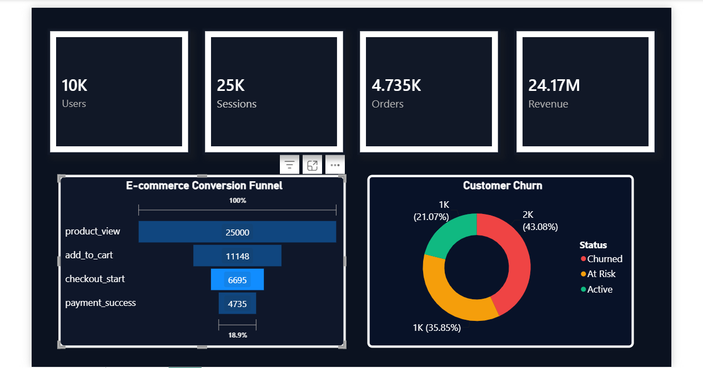

# D2C Churn & Funnel Analyzer

An end-to-end e-commerce analytics project built using **PostgreSQL, SQL, and Power BI** to analyze customer behavior, conversion funnels, revenue performance, and churn risk.

## Dashboard Preview



## Tech Stack

* PostgreSQL
* SQL
* Power BI
* Python (data generation)

## Key Metrics

* **10,000+ Users**
* **25,000 Sessions**
* **4,735 Orders**
* **₹24.17M Revenue**
* **18.9% Funnel Conversion Efficiency**
* **43.1% Customer Churn Rate**

## Project Structure

```text
d2c-funnel-analyzer/
├── data/
├── sql/
├── dashboard/
├── screenshots/
└── README.md
```

## Business Insights

* The largest drop-off occurs between **Product View** and **Add to Cart**.
* Only **18.9%** of sessions convert into purchases.
* **43.1%** of customers are classified as churned, highlighting a significant retention gap.

## Skills Demonstrated

* SQL Aggregation & CTEs
* Funnel Analysis
* Churn Segmentation
* KPI Reporting
* Power BI Dashboard Design
* Business Analytics & Data Storytelling
